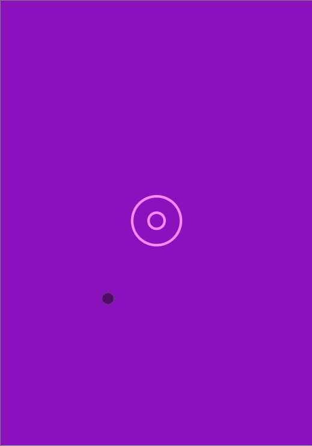

<br />
<p align="center">
  <a href="/">
    
  </a>

<h3 align="center">My Wallet</h3>

  <p align="center">
    A useful app if you have money to manage
    <br />
    <a href="https://github.com/cybalencar96/mywallet-front"><strong>Explore the docs »</strong></a>
    <br />
    <a href="https://mywallet-front-five.vercel.app/">View Demo</a>
    <br />
  </p>
</p>

#

### **About the project**

<br />
<p align="center">

<p>

An animated gif to introduce you to this simple, but very pleasant full-stack project I manage to accomplish!

<br />

### **Built with**

- [React JS](https://reactjs.org/)
- [PostgreSQL](https://www.postgresql.org/)
- [Node JS](https://nodejs.org/en/)
- [Styled Components](https://styled-components.com/)
 <br />

## **Getting Started**

- Want to simply try it? Access demo by [clicking here](https://mywallet-front-five.vercel.app/)!

- Want to run front and back in local environment? Learn how on README in  backend repository by [clicking here](https://github.com/cybalencar96/mywallet-back)!

- Want to run front local not worrying with back? Keep reading then!

<br />

### **Prerequisites**

- npm

<br />

### **Installation**

1. Clone repository

```sh
git clone https://github.com/cybalencar96/mywallet-front.git
```

2. Install dependencies executing command in root

```sh
npm i
```

<br />

### **How to run**

```sh
npm start
```
